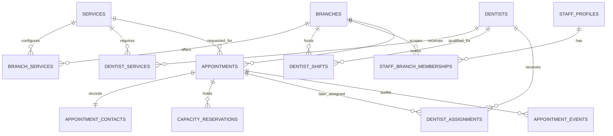

# Initial data and architecture design

Conceptual only — no migrations or production schema created in Sprint 0. Confirmed model: staff confirmation, later staff dentist assignment, branch-scoped receptionists, and pending capacity held until staff acts. D05 capacity configuration still needs details. Apply Supabase/Postgres guidance when implementing, and verify current documentation at that time.

## Architecture

Existing React/Vite app → public catalogue reads and validated booking/tracking functions → PostgreSQL.

Staff app → Supabase Auth session → authorized operations → RLS-protected records. Public catalogue reads expose only intentionally published fields. Complex booking/rescheduling writes run atomically in a database transaction behind a narrow API. No privileged database key belongs in the browser.

`src/lib/clinicApi.ts` is the integration seam. Replace its disconnected implementation feature-by-feature. Do not change the public form to include dentist selection.

## Candidate entities

These relationships are conceptual. Published availability is calculated, not a standalone source of truth. Active assignment uniqueness and reservation constraints will be specified in migrations after the scheduling inputs are reviewed.

| Entity | Key fields / purpose | Visibility |
| --- | --- | --- |
| branches | UUID, stable slug, name, contact details, timezone, active | Published fields public |
| branch_hours / branch_closures | Weekly local hours, date exceptions, closed periods | Availability output only where practical |
| services | UUID, name, description, active | Published catalogue public |
| branch_services | branch_id, service_id, duration_minutes, buffer_minutes, enabled | Public service availability; internal scheduling settings restricted |
| dentists | UUID, published name, bio, photo path, active | Published profile projection only |
| dentist_services | dentist_id, service_id, qualification/eligibility | Staff/internal |
| dentist_shifts / dentist_absences | dentist_id, branch_id, starts_at, ends_at, breaks/exceptions | Staff/internal |
| staff_profiles | auth.users ID, display name, role, active | Restricted |
| staff_branch_memberships | staff_id, branch_id; unique pair | Restricted |
| appointments | UUID, branch_id, service_id, starts_at, ends_at, duration snapshot, status, reference hash, timestamps | Private |
| appointment_contacts | appointment_id, first/last name, normalized mobile, optional email/notes | Private; restrict field exposure |
| availability projection | Derived from shifts, service eligibility/durations, breaks, resources and active reservations; not a manually entered daily slot count | Public output omits internal staff details |
| capacity_reservations | appointment_id, branch/day/slot, reserved interval/units, active state; no automatic pending expiry | Private |
| dentist_assignments | appointment_id, dentist_id, occupied interval; populated later by staff | Private |
| appointment_events | appointment_id, actor ID or system, event type, timestamp, redacted change details | Admin/internal, append-only |
| booking_requests | idempotency key hash, request fingerprint, appointment_id, expiry | Internal |

Use one contact snapshot per appointment initially. Do not treat mobile number as a unique patient identity: families may share phones. A longitudinal patient record belongs to later scope, not an accidental contact deduplication rule.

Foreign keys enforce valid relationships. Candidate indexes: appointments(branch_id, starts_at), active reservation resource/time, staff memberships(user, branch), reference hash uniqueness, and indexes used by RLS predicates. Validate actual query plans before adding more indexes.

## Booking integrity

1. Validate branch, active service, future date, clinic-local rules, normalized contact fields, and request size server-side.
2. Calculate branch/time and remaining daily availability from actual shifts, service eligibility/durations, breaks, physical resources and active holds. All held appointments must remain jointly schedulable; do not use a simple daily count. Do not assign a named dentist during patient submission.
3. In one transaction: validate the selected slot, lock/reserve branch/day/time capacity, create appointment/contact records, record idempotency result and audit event, then commit.
4. At later staff assignment, prevent overlapping active assignment intervals for the same dentist across ALL branches, not just within a branch. Evaluate database exclusion constraints or another transaction-safe strategy against the approved capacity model.
5. Define interval boundaries as start-inclusive/end-exclusive so adjacent appointments do not conflict unless buffer rules require it.
6. Cancelled/rejected requests release capacity through a race-safe, audited staff transition. Pending requests do not expire automatically. A stale-pending queue and manual review procedure are required.
7. Reassignment/rescheduling reserves the new capacity/resource/time and releases the old one atomically; if it fails, preserve the original reservation.
8. Availability is advisory. Recheck inside the write transaction to handle simultaneous requests and staff edits.

D02 selects staff assignment later. A simple count of dentists is insufficient: qualified resources must be available for the entire duration, and the system must preserve a feasible assignment. The user selected system-calculated availability from schedules and durations. Implement a feasibility check across unassigned held appointments: the same qualified dentist cannot be counted twice across overlapping service pools or branches. No patient-visible or final dentist assignment is made at submission. At later staff assignment, validate that the remaining unassigned holds can still be staffed. Lock the affected scheduling scope to serialize competing feasibility checks. If feasible capacity cannot be proven, do not offer/reserve the time. Validate this design with concurrency and mixed-service tests before launch.

## Time and catalogue rules

- Store appointment/reservation instants using timezone-aware timestamps; apply Asia/Manila to clinic-local dates/hours and display.
- End time must be greater than start time; durations/buffers are positive/nonnegative as appropriate.
- Preserve the booked service duration snapshot when the catalogue changes.
- Cross-branch shifts/travel and service-specific chair/equipment capacity are unresolved D05 requirements, not fabricated numbers.
- Alternative suggestions include their actual date as well as time. The review and persisted reservation must use the chosen suggestion's complete timestamp.

## API contract follow-up

Existing getSlots(branchId, serviceId, date) and BookingRequest correctly have no dentist input. A future slot ID is opaque and must be revalidated, not trusted as an authorization token. Add an idempotency key to booking and an expiry/version to slot responses as needed.

Existing track(reference, mobile) is a UI contract only. Implement a rate-limited endpoint with unpredictable references, hashed reference lookup, minimal responses and policy-driven OTP verification (D06). Mobile numbers are not secrets. Do not place references/phones in URL query strings or logs. Avoid responses that reveal which input matched.

The current Appointment display type can show an assigned dentist; this is read-only information, not patient selection. Staff session management, revocation, permissions, status transitions and sign-out need additional backend contracts beyond the current signIn placeholder.

## Migration strategy

Create versioned migrations in Sprint 1 using the installed CLI's supported workflow. Review migrations, policy definitions, grants, and privileged function permissions together. Rebuild a fresh test database from migrations and run policy tests. Staging uses fictional fixtures; production seeds include only clinic-approved public configuration. Protect database and storage backups separately; verify what each backup actually covers.
